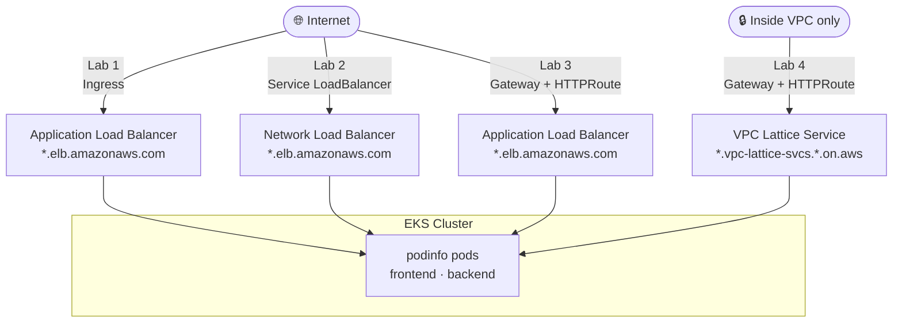

# EKS Load Balancing in Action: ALB, NLB, and Gateway API

**AWS Community Day Romania 2026 - 3-hour hands-on workshop**

Load balancing in Amazon EKS has evolved far beyond the classic "one Ingress, one ALB" model. Today, platform and cloud engineers must navigate multiple options - AWS Application Load Balancer (ALB), Network Load Balancer (NLB), and the emerging Kubernetes Gateway API - each offering distinct capabilities, involving different trade-offs, and carrying unique operational implications.

In this hands-on workshop, we guide participants through the practical realities of traffic management on Amazon EKS. Starting from real-world use cases, we compare ALB and NLB at both the Kubernetes and AWS infrastructure layers, using the AWS Load Balancer Controller as the foundation for provisioning and managing AWS load balancers from Kubernetes. We then move beyond traditional Ingress by introducing the Gateway API and its implementation on EKS, including the AWS Gateway API Controller for Amazon VPC Lattice.

Rather than focusing on theory or product promotion, we work directly with manifests, controllers, and AWS integrations to help attendees understand when to use each approach, why certain designs scale or fail in production, and how Gateway API changes the way teams model networking and ownership in Kubernetes - especially as the ecosystem moves away from legacy Ingress patterns.

Participants leave with a clear mental model of EKS load balancing options, practical deployment experience, and concrete patterns they can apply immediately in their own AWS environments.

## What You'll Learn

- How the AWS Load Balancer Controller provisions ALBs and NLBs from Kubernetes resources
- Path-based HTTP routing using Ingress (ALB) and HTTPRoute (Gateway API)
- The difference between NLB instance mode and IP mode, and when each matters
- Weighted traffic splitting for canary deployments using Gateway API
- The cross-namespace security model (allowedRoutes + ReferenceGrant) that enables multi-team clusters
- East-west service-to-service routing using Amazon VPC Lattice and the AWS Gateway API Controller

## Who Is This For

Cloud and DevOps engineers with basic Kubernetes knowledge who want hands-on experience with AWS load balancing on EKS, no deep networking knowledge required as labs progress from simple to advanced.

## Key Details

| Item                                     | Value                           |
|------------------------------------------|---------------------------------|
| Cluster                                  | `awscdro-eks` in `eu-central-1` |
| Sample app                               | podinfo 6.11.2                  |
| AWS Load Balancer Controller             | v3.2.1 (Helm chart 3.2.1)       |
| Kubernetes Gateway API CRDs              | v1.5.1                          |
| AWS Gateway API Controller (VPC Lattice) | v2.0.2                          |

## Prerequisites

Install the required CLI tools before starting. See [docs/00-prerequisites.md](docs/00-prerequisites.md) for exact versions and install instructions.

Required tools:

- `kubectl` 1.35 (within one minor version of cluster)
- `helm` 3.17+
- `aws` CLI (configured with credentials for the workshop account)

## What You'll Build

Each lab takes the same podinfo application and exposes it through a different AWS load balancing mechanism, using progressively more powerful Kubernetes abstractions:



| Lab | Kubernetes resource | AWS resource | Reachable from |
|-----|---------------------|--------------|----------------|
| [Lab 1: ALB Ingress](docs/04-lab-alb.md) | `Ingress` | Application Load Balancer | Internet |
| [Lab 2: NLB Service](docs/05-lab-nlb.md) | `Service` (LoadBalancer) | Network Load Balancer | Internet |
| [Lab 3: Gateway API](docs/06-lab-gateway-api.md) | `GatewayClass` + `Gateway` + `HTTPRoute` | Application Load Balancer | Internet |
| [Lab 4: VPC Lattice](docs/07-lab-lattice.md) | `GatewayClass` + `Gateway` + `HTTPRoute` | VPC Lattice Service + Service Network | Inside VPC only |

## Workshop Flow

Work through the docs in order. Each step builds on the previous one.

1. [Prerequisites](docs/00-prerequisites.md) - Install required CLI tools (~10 min)
2. [Cluster Setup](docs/01-setup.md) - Provision the EKS cluster with Terraform and create namespaces (~20 min)
3. [Controller Installation](docs/02-controllers.md) - Install Gateway API CRDs and the AWS Load Balancer Controller (~10 min)
4. [Sample Application](docs/03-sample-app.md) - Deploy two podinfo instances as demo backends (~5 min)
5. [Lab 1: ALB Ingress](docs/04-lab-alb.md) - Provision an ALB with Kubernetes Ingress and path-based routing (~25 min)
6. [Lab 2: NLB Service](docs/05-lab-nlb.md) - Provision an NLB with a LoadBalancer Service, compare instance vs IP mode (~25 min)
7. [Lab 3: Gateway API](docs/06-lab-gateway-api.md) - Route traffic with GatewayClass, Gateway, and HTTPRoute resources (~45 min)
8. [Lab 4: VPC Lattice](docs/07-lab-lattice.md) - East-west service routing using Amazon VPC Lattice and the AWS Gateway API Controller (~30 min)
9. [Comparison](docs/08-comparison.md) - Decision guide for ALB vs NLB vs Gateway API vs VPC Lattice (~10 min)
10. [Cleanup](docs/09-cleanup.md) - Tear down lab resources and destroy the cluster (~25 min)

## Repository Structure

```
.
├── docs/               Step-by-step workshop guides (00 through 09)
├── manifests/
│   ├── app/            Shared podinfo Deployments and Services
│   ├── controllers/    Gateway API CRD manifest
│   ├── labs/
│   │   ├── alb/        ALB Ingress manifest
│   │   ├── nlb/        NLB Service and Deployment manifests
│   │   ├── gateway/    GatewayClass, Gateway, HTTPRoute, and ReferenceGrant manifests
│   │   └── lattice/    VPC Lattice GatewayClass, Gateway, and HTTPRoute manifests
│   └── namespaces/     Namespace definitions (single source of truth)
├── helm/               Helm value overrides for controller installation
├── iam/                IAM policy documents for AWS LBC and Gateway API Controller
├── scripts/            Cross-platform prerequisite setup scripts (setup.sh, setup.ps1)
└── *.tf                Terraform configuration for the EKS cluster and supporting infra
```

## Authors


**Claudiu Sonel** · [GitHub](https://github.com/csonel) · [LinkedIn](https://linkedin.com/in/csonel)<br>
Senior DevOps Consultant @ Endava · AWS Community Builder

<br clear="left">


**Elif Samedin** · [GitHub](https://github.com/elifsamedin) · [LinkedIn](https://linkedin.com/in/elifsamedin)<br>
Senior Platform Engineer @ AirDNA · CNCF Ambassador

<br clear="left">

## TODO

- [x] Add architecture diagrams showing traffic flow for each lab (Internet → ALB/NLB/Gateway → EKS pods)
- [x] Add a "What you'll build" visual summary for each step
- [x] Improve the authors section
- [x] Test the setup script on Windows
- [ ] EKS: add instructor access entries before the workshop
